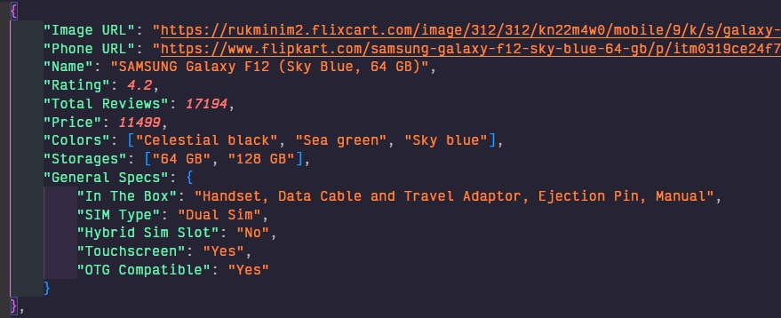

# Scrapy Web Mining

## _Scarping Mobile phones from Flipkart_

| Details             |                    |
| ------------------- | ------------------ |
| Name                | Ritvik Gupta       |
| Registration Number | 19BCE0397          |
| Assignment          | 4th - Web Scraping |

Web Scraped data includes the following attributes for both phone types:

- **Image URL** - The main photo of the phone
- **Phone URL** - Link to the page for the phone on flipkart for the consumer
- **Name**
- **Rating** - Average rating of the phone by reviewrs
- **Total Reviews**
- **Price**
- **Colors** - Model colors available
- **Storages** - Model storage space available (eg: 64GB)
- **General Specs** - Specifications such as In The Box, SIM Type, Hybrid Sim Slot, Touchscreen, OTG
  Compatible.

    <p align="center"></p>

> Scrapy is a tool like BeautifulSoup ( bs4 ) for web scraping but unlike the latter provides much
> more features along with parallel scraping multiple webpages and recursively scraping paginated
> sites.

#### Project includes two spider scripts as following:

- Scrape a limited amount of Samsung Galaxy Phones, from the [first page][samsung-first-page], and
  store the scraped data in a JSON format with multiple fields in a nested structure

- Scrape recursively through all iPhones from all 15 pages ( starting from [first
  page][apple-first-page] ) present on flipkart for different models. Each paginated page would call
  its "Next" page and follow the links to the end. Scraped data is stored in CSV format and cannot
  have nested structure so the "General Specs" is flattened out.

> Details about mining each individual component during the scraping process can be found and
> followed in detail with comments specified

## Tools Used

Main and only tool used is [Scrapy] for Python ( following the
[tutorial](https://docs.scrapy.org/en/latest/intro/tutorial.html) ).

## Generating and Running Spiders

To genrate the two spiders the command used is

```sh
scrapy genspider <spider-name> <main-url-used>
```

> Note: Spider Names need to be unique to identify the spiders In our case they are
> `flipkart_iphones` and `flipkart_galaxys`

To run a specific spider

```sh
scrapy crawl <spider-name-provided> -O <output-file>.<csv|json>
```

> Note: The flag `-O` overwrites any previous content and `-o` appends.

[samsung-first-page]:
	https://www.flipkart.com/mobiles/pr?sid=tyy%2C4io&p%5B%5D=facets.brand%255B%255D%3DSAMSUNG&otracker=clp_metro_expandable_7_3.metroExpandable.METRO_EXPANDABLE_Shop%2BNow_mobile-phones-store_Q0QIS4SPJNLH_wp3&fm=neo%2Fmerchandising&iid=M_346e3244-39f0-41e5-9bba-b53bf061418f_3.Q0QIS4SPJNLH&ppt=hp&ppn=homepage&ssid=64a7ventkg0000001645414617403&page=1
[apple-first-page]:
	https://www.flipkart.com/mobiles/pr?sid=tyy%2C4io&p%5B%5D=facets.brand%255B%255D%3DApple&otracker=clp_metro_expandable_6_3.metroExpandable.METRO_EXPANDABLE_Shop%2BNow_mobile-phones-store_92RED14GXPXF_wp3&fm=neo%2Fmerchandising&iid=M_601c4f2d-8f76-4c55-a92d-ad96ecdded4d_3.92RED14GXPXF&ppt=browse&ppn=browse&ssid=665qlfhk1s0000001645344877842&page=1
[scrapy]: https://scrapy.org/
